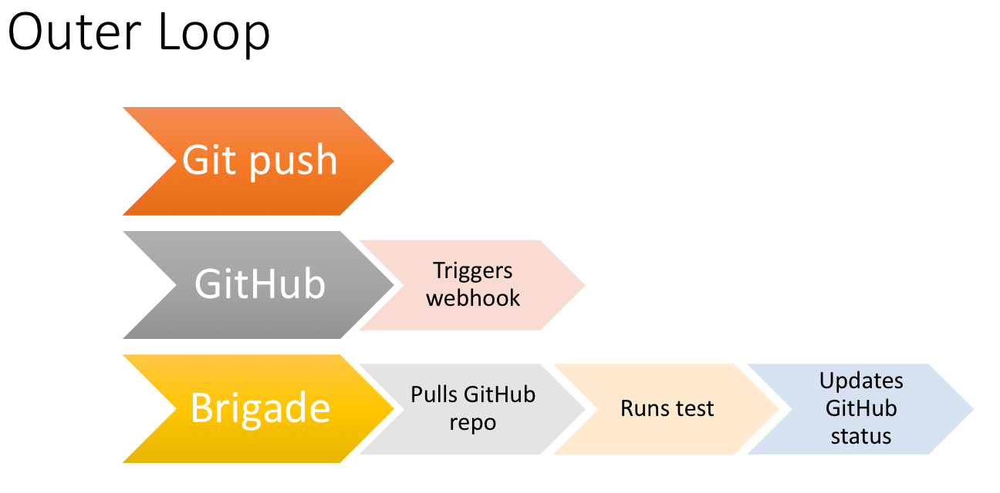

# node-demo: Using Draft + Brigade for creating a Node.js app

This is a demonstration project that combines several develope tools to create a
multi-layered create/test/debug/deploy environment.

## About the Demo

This demo uses the following:

- [Draft](https://draft.sh) for creating and running this application.
- [Brigade](https://brigade.sh) for executing various sequences of tests.
  - The GitHub gateway is used to integrate with the GitHub repository
  - The CR gateway is used to integrate with DockerHub
- Git for VCS
- DockerHub for storing images, and for trigger webhooks
- An [AKS](https://docs.microsoft.com/en-us/azure/aks/) Kubernetes cluster for
  hosting (though any public Kubernetes cluster will do)
- [Slack](https://slack.com) to notify you if your in-cluster tests fail

The idea is that when one runs `draft up`, Brigade silently runs in-cluster tests
against the created artifacts while Draft sets everything up for you to do manual
testing and debugging. This makes testing a transparent part of "inner loop"
development.

Then, upon a `git push` to GitHub, the "outer loop" testing is triggered, and
Brigade plays the role of a more traditional CI system.

## Setting Up the Demo

You need to have the following configured first:

- You should have a DockerHub or ACR registry configured
- You should have a Kubernetes cluster capable of routing traffic from the public
  network. (In other words, _not minikube_)
- Draft should be installed locally, with the registry set to DockerHub or ACR
- Brigade should be installed, with the GitHub and CR gateways enabled and mapped
  to public IPs/domains

1. Clone this repository
2. `draft up && draft connect` to verify that everything works
  - You should be able to point your browswer to http://localhost:8181/hello and see the result.
3. Copy `example-values.yaml` to `values.yaml`, edit it, and then
  `helm install -n dev-node-demo brigade/brigade-project -f values`
4. Go to DockerHub and find the image that you created in step #2 [example](https://hub.docker.com/r/technosophos/node-demo/)
5. In DockerHub, click on the _webhooks_ tab and add a new webhook pointing to your
  container registry and the project you created in #3, e.g. `http://cr.example.com/events/webhook/brigade-878e1cf8935c772c02d513d2eb9a8`
  - You can use `brig project list` to see your project ID if you can't locate it otherwise
  - You can use `helm get dev-node-demo` to find the secret that has the project ID as the name, as well
6. You can now `draft up` again, and it will not only do the usual drafty stuff,
  but should also create a new build. Check out `brig build list` to verify that
  a new Brigade build was created
7. On your GitHub fork of this repo, go to _settings->webhooks_ and add a new webhook:
  - Set _Payload URL_ to your GitHub gateway, e.g. `https://gh.example.com:7744/events/github`
  - Set _Content type_ to JSON
  - Create a secret for _Secret_, and make a note of it
  - Check _Just the push event_
  - Click _Add webhook_
8. Now create an outer loop Brigade project:
  - `helm inspect values brigade/brigade-project > github-values.yaml`
  - Edit `github-values.yaml` setting the `cloneURL` to your fork of this repo,
    and the sharedSecret to the secret you created in step #7 above.
  - OPTIONAL: You may also want to generate a Personal Access Token in GitHub and
    put it in the values file as a `github.token`.
  - Make sure the `project:` field is different than the one in your previous `values.yaml`
  - `helm install -n github-node-demo brigade/brigade-project -f github-values.yaml`
9. Do a `git push` and verify that the build is done.

> `brig build logs --last --jobs` is your friend.

## Questions

**Why create two `brigade-project`s?**

The idea was to demonstrate what a separated developer/ops would look like. Here,
both can share the same source repo and the same `brigade.js`, but have different
permissions, secrets, etc.

And actually, we need two different sidecars for our two types of build. To support
both GitHub and Draft as runnders, we'd have to build a slightly more elaborate
sidecar.

**How did you keep the local version from using the Git repo?**

We swap the `vcs-sidecar` image to not use `git-sidecar` and to instead use the
Docker image that Draft generates. Then we tool that to act differently depending
on whether it is invoked as a Brigade init container or as a main app.

**What do I need to change for ACR?**

To use ACR, you need to alter the `image_push` event in `brigade.js` to use the
ACR webhook payload instead of the DockerHub payload.

**How does the Draft image work as a sidecar and as an app?**

The entrypoint `start.sh` detects whether it is executing as a sidecar. If not,
it starts the node server.
